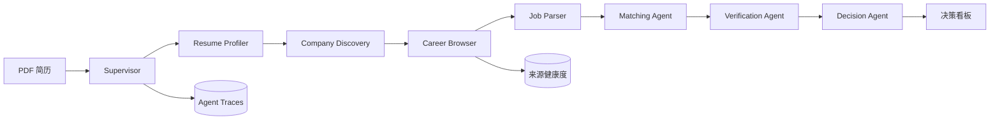

# CareerPilot CN · 中国官网求职决策 Agent

[](https://github.com/HexiWu/careerpilot-cn/actions/workflows/ci.yml)
[](https://www.python.org/)
[](LICENSE)

CareerPilot CN 是一个面向中国招聘场景的多 Agent 求职研究与岗位决策系统。用户上传 PDF 简历后，系统从企业官方招聘站获取公开岗位，执行结构化解析、证据匹配、来源验证和决策排序，并展示完整 Agent 运行轨迹。

项目默认不依赖付费 LLM API；简历解析、职位归一化和可解释排序都能在本地完成。它适合作为可独立运行、可测试、可演示的 Agent Engineering 作品集项目。

## 核心能力

- **多 Agent 编排**：Supervisor 协调 7 个专职 Agent，支持失败隔离、重试和结构化状态传递。
- **公司官网优先**：内置 34 家企业的中国招聘入口；为腾讯、网易、华为、大疆、滴滴、联想、Amazon 中国和 Apple 中国实现 8 个专用官网适配器，其余站点使用 JSON-LD、嵌入 JSON 和 HTML 多级降级解析。
- **实时与可核验**：保存岗位首次/最后发现时间、内容哈希、官网链接和来源类型；网页变化或受限状态会进入来源监控，而不是静默伪造数据。
- **简历证据匹配**：从中英文 PDF 提取技能、教育和经历，输出 8 维评分、匹配证据、能力缺口、风险和置信度。
- **可观测性**：每个 Agent 的开始、完成、重试、错误和关键指标都持久化到 SQLite，并可在 Web 控制台追踪。
- **完整交付形态**：FastAPI、响应式 Web UI、CLI、定时同步、Docker、GitHub Actions 和自动化测试。

## Agent 工作流



更完整的状态、失败策略和数据边界见 [架构文档](docs/architecture.md)。

## 本地运行

要求 Python 3.11 或更高版本。

```bash
python -m venv .venv
source .venv/bin/activate
python -m pip install -e '.[dev]'
careerpilot serve --host 127.0.0.1 --port 8000
```

打开 `http://127.0.0.1:8000`，上传 PDF 简历并点击“开始官网研究”。Swagger 文档位于 `http://127.0.0.1:8000/docs`。

也可以只使用 CLI：

```bash
careerpilot parse-resume /path/to/resume.pdf
careerpilot sync --resume /path/to/resume.pdf --companies 50
```

`--companies 50` 会覆盖当前全部 34 家注册企业，并为以后扩容预留空间。

## 实时官网数据源

| 企业 | 官方入口 | 采集方式 | 单次上限 | 2026-07-21 验收 |
|---|---|---|---:|---:|
| 腾讯 | careers.tencent.com | 官网公开职位 API | 100 | 100 |
| 网易 | hr.163.com | 官网公开职位 API | 100 | 100 |
| 华为 | career.huawei.com | 官网公开职位 API，自动分页 | 200 | 166 |
| 大疆 | careers.dji.com | 官网 Moka 公开初始化数据 | 页面公开量 | 15 |
| 滴滴 | talent.didiglobal.com | 官网公开职位 API | 接口公开量 | 16 |
| 联想 | jobs.lenovo.com | 官网 Avature 分页，仅中国职位 | 100 | 8 |
| Amazon 中国 | amazon.jobs | 官网 JSON 搜索，仅 `CHN` | 100 | 100 |
| Apple 中国 | jobs.apple.com | 官网服务端结构化数据，自动分页 | 100 | 100 |

真实联网验收中 8 个专用源全部为 `healthy`，单次共返回 605 个岗位；完整 34 家官网 + 真实简历的端到端验收共发现 636 个岗位，其中 10 家来源健康，并对全部岗位完成匹配与验证。该数字是 2026-07-21 的验收快照，不是写死数据；每次运行都会重新请求官网。其余 26 家入口同样进入健康扫描，无法静态解析、受 robots 限制或需要验证码时会分别记录为 `empty`、`blocked_by_robots` 或 `restricted`，不会冒充成功。

## Docker

```bash
docker compose up --build
```

服务默认暴露在 `http://127.0.0.1:8000`，SQLite 数据保存在 `careerpilot-data` volume 中。

## 测试与质量门禁

```bash
ruff check .
pytest --cov=careerpilot --cov-report=term-missing --cov-fail-under=70
```

CI 会在 Python 3.11 和 3.13 上执行静态检查、单元测试、API 集成测试以及覆盖率门禁。外部招聘站不会进入 CI：网络行为通过 `httpx.MockTransport` 固定，以避免不稳定测试和对官网产生额外流量。

## 数据源与合规边界

- 仅访问企业官网公开页面或官网前端使用的公开接口。
- 遵守 `robots.txt`；遇到登录、验证码或访问限制时立即停止，并记录为 `restricted` 或 `blocked_by_robots`。
- 不绕过身份验证，不使用私人 Cookie，不自动投递，不采集个人招聘账号数据。
- 不承诺所有官网永远可解析。官网结构变化会通过来源健康度暴露，适配器可以独立更新。
- 不复制需要动态签名、登录或验证码的私有接口；例如这类站点保留在官网健康扫描中，而不会绕过其访问保护。
- 推荐结果用于辅助决策，不代表企业录用结论。

## 技术栈

Python 3.11+ · FastAPI · Pydantic v2 · httpx · BeautifulSoup · pdfplumber · SQLite · Vanilla JS · pytest · Ruff · Docker · GitHub Actions

## API 摘要

| 方法 | 路径 | 用途 |
|---|---|---|
| `POST` | `/api/resumes/upload` | 上传并解析 PDF 简历 |
| `POST` | `/api/research` | 运行多 Agent 官网研究流程 |
| `GET` | `/api/recommendations` | 获取可解释岗位推荐 |
| `GET` | `/api/jobs` | 搜索已同步岗位 |
| `GET` | `/api/traces` | 查看 Agent 运行轨迹 |
| `GET` | `/api/sources` | 查看官网来源健康度 |
| `POST` | `/api/applications` | 更新个人申请看板状态 |

## 作品集说明

项目亮点、面试讲法与可直接改写的简历条目见 [作品集指南](docs/portfolio.md)。

## License

[MIT](LICENSE)
