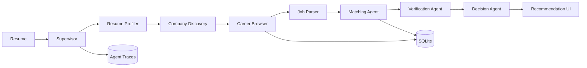

# Architecture

The supervisor executes a durable, inspectable workflow. Each specialist receives structured
state and emits structured output. Tools are domain-restricted and guardrails prevent access to
login-only or CAPTCHA-protected pages.

