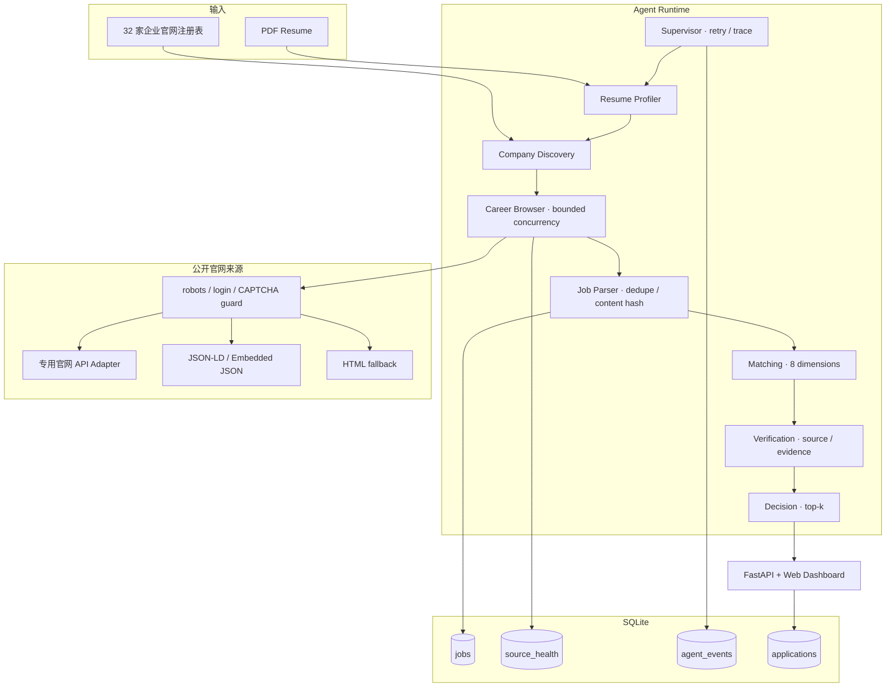

# 系统架构

## 设计目标

CareerPilot CN 把“上传简历 → 搜索官网 → 解析岗位 → 证据匹配 → 给出决策”建模成一个可观察的 Agent 工作流。每个 Agent 只处理一个边界清晰的职责，共享强类型 `WorkflowState`，Supervisor 负责顺序、重试和终止。

## Agent 职责

| Agent | 输入 | 输出 | 失败策略 |
|---|---|---|---|
| Resume Profiler | `ResumeProfile` | 技能、经历、目标岗位 | 无简历则终止 |
| Company Discovery | 目标方向、官网注册表 | 有优先级的企业集合 | 使用默认企业集合 |
| Career Browser | 企业集合 | 原始标准化岗位、来源健康度 | 并发隔离单一来源失败 |
| Job Parser | 岗位集合 | 去重、持久化岗位 | 内容哈希区分更新与未变化 |
| Matching | 简历、岗位 | 8 维匹配分 | 无付费模型时保持确定性 |
| Verification | 推荐集合 | 已验证推荐、风险标记 | 拒绝非 HTTPS，降权未验证来源 |
| Decision | 已验证推荐 | Top-K 决策清单 | 始终保留证据和置信度 |

## 官网采集策略

采集层按可靠性由高到低执行：

1. 企业官网公开 API 的专用适配器。
2. `JobPosting` JSON-LD。
3. 页面嵌入的职位 JSON。
4. 语义化职位卡片和官方详情链接。

所有来源先经过公开访问守卫。若 `robots.txt` 禁止、页面需要登录/验证码，系统不会尝试规避，而是在 `source_health` 中记录原因。不同企业的失败互不影响。

## 匹配模型

匹配采用确定性权重模型：技能、经历、项目、岗位方向、资格条件、行业、地点和成长性共 8 个维度。输出不仅包含总分，还包含：

- 命中的简历技能或经历证据；
- 职位要求但简历缺失的技能；
- 来源或资格风险；
- 根据证据覆盖度计算的置信度。

这种设计便于单元测试、离线演示和面试解释，也预留了将某个 Agent 替换为 LLM 或向量检索的接口。

## 数据更新语义

岗位身份由公司、标题、地点和官网 external ID 生成指纹；正文、要求和地点生成内容哈希。重复同步时：

- 新指纹：`created`；
- 同一指纹但内容哈希变化：`updated`；
- 指纹和内容均不变：`unchanged`。

每次采集都会刷新 `last_seen_at`，并把 Agent 事件、指标和来源状态写入 SQLite。

## 安全边界

- API 只允许选择内置白名单企业，避免任意 URL 带来的 SSRF。
- PDF 大小上限为 10 MB，不保存原始简历正文到岗位数据库。
- 不执行简历中的内容，不自动投递，不持有招聘账号凭证。
- 外部官网请求设置超时、并发上限和明确 User-Agent。
